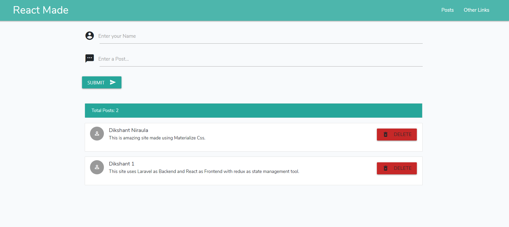

#<b>This site is made using Laravel for api development, React as Frontend and react-redux as state management tool.</b>
    
    In this site we have made an api for adding post, getting post and deleting post using laravel api and controller..
    and use it in react to perform action from UI without refreshing of page.
    
    This is made beautifully using react redux.
    

    This site looks like this and is made using Materialize css
    
    To use this we can simply
    
    1. git clone https://github.com/DikshantNiraula/Laravel-React-Redux-setup
    2. make a .env file and add credential necessary (database,user and password)
    3. composer update
    4. php artisan key:generate
    5. npm install
    6. npm run dev
    7. php artisan serve and npm run watch and we can open the site in localhost:8000
    
    Thank you...
